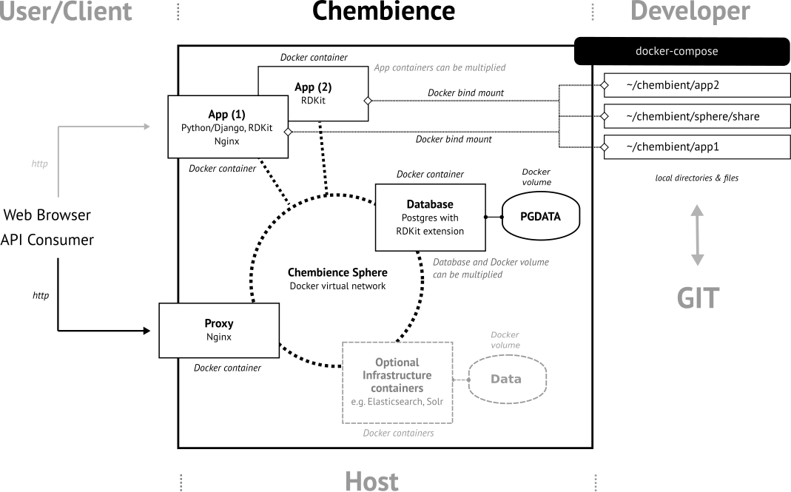

Chembience
==========

.. image:: https://circleci.com/gh/chembience/chembience/tree/master.svg?style=shield
    :target: https://circleci.com/gh/chembience/chembience/tree/master
    
.. image:: https://zenodo.org/badge/124780116.svg
   :target: https://zenodo.org/badge/latestdoi/124780116

.. image:: https://img.shields.io/github/release/chembience/chembience.svg
   :target: https://img.shields.io/github/release/chembience/chembience.svg

.. image:: https://img.shields.io/github/license/chembience/chembience.svg
   :target: https://img.shields.io/github/license/chembience/chembience.svg

Overview
--------

**Chembience** is a `Docker <https://docs.docker.com/>`_ based platform supporting the fast development of
`chemoinformatics <https://en.wikipedia.org/wiki/Cheminformatics>`_-centric web applications and microservices.
It creates a clean separation between your scientific web service implementation and any host-specific or
infrastructure-related configuration requirements. The following schema provides an overview.

At its current development stage, Chembience provides three types of template application (*App*) packages: (1) a
`Django <https://www.djangoproject.com/>`_/`Django REST framework <https://www.django-rest-framework.org/>`_-based
*App* which is specifically suited for the development of web-based `Python <https://www.python.org/>`_
REST and microservices, (2) a RDKit/Python shell-based *App* which allows for the execution of Python scripts (including
RDKit, see below), and (3), a `Jupyter <https://www.jupyter.org/>`_-based *App* which let you run Jupyter
notebooks locally on a Web browser (currently only a Python kernel is supported).

All template *Apps* have pre-configured access to a `Postgres <https://www.postgresql.org/>`_ databases instance
(*Database*) running in a separate Docker container on the same Docker virtual network (*Chembience Sphere*).
Any of the *App* Docker images and the Postgres database image have the `RDKit <http://www.rdkit.org/>`_  toolkit installed
either as Python module or Postgres extension. Additionally, both the Django and the Jupyter *App* packages
provide a `Nginx <https://www.nginx.com>`_-based web server instance as component of their Docker image.

Creation and deployment of all Chembience-based Docker images and containers is orchestrated by
`docker-compose <https://docs.docker.com/compose/>`_. All Docker images required for starting up one of the Chembience
*App* packages are continuously built and tested at `CircleCi.com <https://circleci.com>`_ and made available
from the `Chembience Docker hub repository <https://hub.docker.com/u/chembience/>`_). Alternatively, the Docker images
can also be built locally on the user's host machine by using the provided build script.

If a Chembience-based application is started, a Docker virtual network (*Chembience Sphere*) is created on the Docker
host system, as well as the requested *App* and infrastructure containers, e.g. the *Database* container,
are brought up together at once. Depending on the current use case, a different set of the available Chembience
container components can be easily configured and put together by adjusting the docker-compose configuration file.

Another component of Chembience is the Chembience *Proxy* which has been created as a fork of the
`jwilder/nginx-proxy project <https://github.com/jwilder/nginx-proxy>`_. The *Proxy* acts as a reverse proxy in front of
all *App* containers and allows for spinning up additional container instance, or updating and removing existing ones
while avoiding interference with web traffic to other running Chembience-based services and containers. The *Proxy* works in
a way that it automatically discovers any existing or newly starting *App* container inside the *Chembience Sphere*
virtual network and looks up their (sub) domain specification. It then makes the *App* containers accessible to the
outside of the *Chembience Sphere* network under their specified domain names which might be either a DNS-registered
Web domain, or any sub domain at localhost for locally running Web applications.

All of the Chembience *App* packages can be easily altered, cloned, removed, or reconfigured. After the initialization of
the Chembience base system (see `Quick Start: Base Installation`_ below), the initially created *App* package directories
can be moved, renamed, or copied, in order to create multiple, specialized application packages, which then can be
handled as software projects of their own. If additional infrastructure packages are needed
for a project (e.g. Solr, elasticsearch, or additional Postgres container instances), they can be easily integrated
as additional components as part of docker-compose configuration.

Current release version of the most important packages are:

* RDKit 2019.09.1
* Python 3.7.3
* Django 2.2.6 + Django Rest Framework 3.10.2
* Jupyter 5.7.4
* Postgres 11.5
* Nginx 1.14 (Reverse Proxy)

History
-------

The development of Chembience originally started as a component of the `InChI-Resolver <https://prototype0.inchi-resolver.org/openapi>`_ project (the alpha version of the InChI resolver is currently in the process of being migrated from a predecessor version of Chembience to the current version provided here).

Releases
--------

- 0.2.14 (October 2019), update to RDKit 2019.09
- 0.2.13 (September 2019), update to RDKit 2019.03.4, Postgres 11.5 and Django 2.2.6
- 0.2.12 (August 2019), update to RDKit 2019.03.3, Postgres 11.4; (Mini)Conda has been updated to version 4.7.10
- 0.2.11 (June 2019), update to RDKit 2019.03.2, Django 2.2, Postgres 11.3; all Docker images are now based on Debian buster
- 0.2.10 (Easter 2019), update to RDKit 2019.03
- 0.2.9 (April 2019), update to Postgres 11.2
- 0.2.8 (March 2019), update to RDKit 2018.09.2 and Postgres 10.7
- 0.2.7 (January 2019), maintenance release
- 0.2.6 (November 2018), update to RDKit 2018.09.1 and Python 3.7
- 0.2.5 (October 2018), update to RDKit 2018.09, project improvements for production settings (easier Nginx proxy config; separation of app services and proxy)
- 0.2.4 (September 2018), SSL certificate registration with `Let's Encrypt <https://letsencrypt.org/>`_, project improvements
- 0.2.3 (August 2018), update to RDKit 2018.03.4, Postgres 10.5, Django 2.1 and Nginx 1.14, further project clean-up
- 0.2.2 (July 2018), CircleCi builds, automated UID and GID configuration, clean up & bug fixes
- 0.2.1 (June 2018), update to RDKit 2018.03.2, switch to Postgres 10.4
- 0.2.0 (May 2018), switch to RDKit 2018.03, addition of Jupyter *App* container, project clean-up
- 0.1.1 (April 2018), minor bug fixes
- 0.1.0 (March 2018), first beta

Requirements
------------

Please have at least `Docker CE 17.09 <https://docs.docker.com/engine/installation/>`_ and `Docker Compose 1.17 <https://docs.docker.com/compose/install/>`_ installed on your system.

Quick Start: Base Installation
------------------------------

Clone the repository::

    git clone https://github.com/chembience/chembience.git chembience

Then, change into the newly created directory ::

    cd chembience/

and run the following command (it is important that you do this from inside the ``chembience`` directory) ::

    ./init

As a first step, this will download all necessary Chembience Docker images to your system and may take a while for the
initial setup (approx 3.5GB of downloads from DockerHub). After a successful download, a new directory ``chembient/`` is
created in your home directory ::

    cd ~/chembient

which has the following layout ::

    chembient/django
             /rdkit
             /jupyter
             /share
             /sphere

The first three directories contain a prototype versions of the Django-, RDKit and Jupyter-based applications, respectively.
The location and name of these base application directories is freely configurable (in fact, it isn't even required to keep them in the
``chembient`` parent directory). The ``share/`` directory can be used to store resources and (python) packages that should
be common to all *App* packages. The ``sphere/`` directory holds scripts and files related to all core infrastructure
components (e.g. the *Database* and *Proxy* containers).

Quick Start: Django Template App
--------------------------------

After the quick start installation of Chembience (see previous section `Quick Start: Base Installation`_), go into directory ::

    cd ~/chembient/django

which has the following layout ::

    .env
    appsite
    build
    django-manage-py
    docker-compose.build.yml
    docker-compose.shell.yml
    docker-compose.yml
    docker-entrypoint.sh
    Dockerfile
    down
    psql
    requirements.txt
    shell
    up
    uswgi-log

For this quick start section, only the most important of these files will be discussed. The command ``./up`` will start
up the Django *App* container and the *Database* container (the initial configuration of the containers is provided in
the ``.env`` file and the ``docker-compose.yml`` file, **NOTE**: the Django *App* container connects to
port 8000 of the host system, if this port is already in use, it can by reconfigured in ``.env``, see variable
``DJANGO_APP_CONNECTION_PORT``). If everything went fine, you should now be able to go to ::

    http://localhost:8000      (you should see the welcome page of a bare Django installation)

For the initial setup of Django, still a few steps needs to be done. Since Django runs inside a Docker container you can
not directly access Django's ``manage.py`` script to set up things. Instead you have to use the ``django-manage-py``
script provided in the current directory which passes any arguments to the ``manage.py`` script of the Django instance
running inside the Django *App* container.

To finalize the initial setup of Django in your container instance, run these commands (except for using ``django-manage-py``
instead of ``manage.py`` these are the same steps as for any Django installation for setting up Django's admin pages) ::

    ./django-manage-py migrate           (creates the initial Django database tables)
    ./django-manage-py createsuperuser   (will prompt you to create a Django superuser account)
    ./django-manage-py collectstatic     (adds all media (css, js, templates) for the Django admin application; creates a static/ directory in the django directory)

After running these commands you should be able to go to::

    http://localhost:8000/admin

and login into the Django admin application with the just set up account and password.

If you want to start the development of own Django apps, go into the ``appsite`` directory. If you already know how to develop
with Django, this should look familiar to you. If not, go to the `official Django tutorial <https://docs.djangoproject.com/en/2.0/intro/tutorial01/>`_
as a starting point (you can jump there to section *Creating the Polls app* because anything before this step is already done, also any
database setup sections can be skipped). Because the ``appsite`` directory is bind-mounted by Docker into the Django *App* container,
anything you change there is immediately represented inside the container and the web service you are working on
(if not, touch directory ``appsite``; for some changes in ``appsite/appsite`` and settings.py a container restart might
be necessary, using  ``./short``).

In order to bring the whole Chembience stack of Django *App* and *Database* down again, use the ``down`` script::

    ./down

Anything you have created and stored so far in the database has been persisted. If you are familiar with ``docker-compose``,
all life-circle commands should work as expected, in fact, ``up`` and  ``down`` are just short cuts for their respective
``docker-compose`` commands.

Starting with Chembience version 0.2.4, the Chembience *Proxy* container has to be started separately (see below).
However, this isn't required for the purpose of a locally running development instance of the Chembience Django *App*.

Quick Start: RDKit Template App
-------------------------------

After the quick start installation of Chembience (see section `Quick Start: Base Installation`_), go into directory ::

    cd ~/chembient/rdkit

You will see the following layout::

   build
   context
   docker-compose.build.yml
   docker-compose.shell.yml
   docker-compose.yml
   docker-entrypoint.sh
   Dockerfile
   psql
   requirements.txt
   run
   up

For this quick start section, only the most important of these files will be discussed. The ``./up`` command will start
up the database and the *App* container executing a regular python shell interactively. For connecting to the database, do the
following (if you use an unchanged Chembience configuration, use the shown database connection parameters verbatim,
they are not just placeholders):

.. code-block:: python

    import psycopg2
    import pprint

    conn_string = "host='db' dbname='chembience' user='chembience' password='Arg0'"
    conn = psycopg2.connect(conn_string)
    cursor = conn.cursor()

    # rdkit extension installed?
    cursor.execute("select * from pg_extension")
    extensions = cursor.fetchall()
    pprint.pprint(extensions)

If you use the ``./run`` command, it does the same without starting an interactive shell, however it will pass any command
line arguments to the Python interpreter of the *App* container. The Python interpreter has the current directory
(``~/chembience/rdkit``) available on its PYTHONPATH, i.e. if you add a script named script.py to the RDKit *App*
directory you can run it like this::

    ./run script.py

The same is true for any python module or package put into the ``~/chembience/share`` directory.

Quick Start: Jupyter App
------------------------

After the quick start installation of Chembience (see previous section `Quick Start: Base Installation`_), go into directory ::

    cd ~/chembient/jupyter

which has the following layout ::

    .env
    build
    docker-compose.build.yml
    docker-compose.shell.yml
    docker-compose.yml
    docker-entrypoint.sh
    Dockerfile
    down
    jupyter
    jupyter_notebook_config.py
    notebooks
    psql
    requirements.txt
    shell
    up

For this quick start section, only the most important of these files will be discussed. The command ``./up`` will start
up the Jupyter *App* container and the *Database* container (the initial configuration of the containers is provided in
the ``.env`` file and the ``docker-compose.yml`` file, ***NOTE**: the Jupyter *App* container connect to port 8001 of the
host system, respectively, if this port is already in use, it can by reconfigured in ``.env``, , see variable
``JUPYTER_APP_CONNECTION_PORT``). If everything went fine, you should now be able to go to ::

    http://localhost:8001       (you should see the login page of the Jupyter notebook server)

Login to the Jupyter notebook server with the password ``Jupyter0``. If you know Jupyter, everything should look familiar
to you now. If you are new to Jupyter, you can find the `documentation here <http://jupyter-notebook.readthedocs.io/>`_.
Since Jupyter runs inside a Docker container, its ``jupyter`` command is not accessible directly; instead you have to
use the ``jupyter`` script inside the Juypter *App* directory which will pass all subcommands into the running container::

    ./jupyter [subcommands]

If you want to add and run existing Jupyter notebooks to the Jupyter *App* container, you need to place them in directory::

    ~chembient/jupyter/notebooks

Likewise, if you create new Jupyter notebooks in the Jupyter app and safe them, you will find them at this directory.

In order to bring the whole Chembience stack of Jupyter *App* amd *Database* down again, use the ``down`` script::

    ./down

It will keep anything persistent you have created and stored so far in the database. If you are familiar with ``docker-compose``,
all life-circle commands should work as expected, in fact, ``up`` and  ``down`` are just short cuts for their respective
``docker-compose`` commands.

Starting with Chembience version 0.2.4, the Chembience *Proxy* container has to be started separately (see below).
However, although the *Proxy* would allow to do so, it is *strictly* not recommended to run a public facing instance
of the Jupyter *App* (or Jupyter notebook in general).

Quick Start: Proxy
------------------

Beginning with Chembience version 0.2.4, the *Proxy* container isn't started as part of the Django and Jupyter *App*
package anymore. Instead, it has to be started separately. If Chembience is used in default configuration, go into
directory ::

    cd ~/chembient/sphere

and use the ``up`` script there ::

    ./up-without-letsencrypt

This will make the *Proxy* available at ::

    http://localhost        (don't worry, the reverse proxy will report with *503 Service Temporarily Unavailable* there)

The *Proxy* will connect to port 80 of the host system. If this port is in use, set variable ``CHEMBIENCE_PROXY_EXTERNAL_PORT``
of the ``.env``file of the current directory before using ``./up``. If either the Django or Jupyter *App* are running,
they are also now available from the *Proxy* (if this doesn't work your local network configuration might not allow
for resolving subdomains) ::

    http://django.localhost
    http://jupyter.localhost

Please note that using the *Proxy* isn't necessary when using Chembience just for development purpose.

Using the Proxy in production setting and with HTTP
----------------------------------------------------

As a prerequisite, your DNS-registered domain (e.g. www.example.com) has to be set up properly with your domain provider.
Unfortunately it is hard to give a general description here.

Bring the proxy up as described in the `Quick Start: Proxy`_ section. The port the *Proxy* is connecting to needs to
be set to a outside-accessible port on your public web server/host (usually port 80).

Additionally, before any Django *App* is brought up, the variable DJANGO_APP_VIRTUAL_HOSTNAME in the ``.env`` file of
the Django app has to be set to the URL-domain, e.g. "www.example.com".

Using the Proxy in production setting and with HTTPS
----------------------------------------------------

As a prerequisite, your DNS-registered domain (e.g. www.example.com) has to be set up properly with your domain provider.
Unfortunately it is hard to give a general description here.

For HTTPS access, the *Proxy* container has to be started from ::

    cd ~/chembient/sphere

and the command::

    ./up

The *Proxy* will connect to port 80 and 443 of the host system. If these ports aren't available, set variable
``CHEMBIENCE_PROXY_EXTERNAL_PORT`` and ``CHEMBIENCE_PROXY_EXTERNAL_SSL_PORT`` of the ``.env`` file of the current directory
before using the up command.

Additionally, before any Django *App* is brought up, set both the variable ``DJANGO_APP_VIRTUAL_HOSTNAME`` and ``LETSENCRYPT_HOST``
in the ``.env`` file of the Django app to your URL-domain, e.g. "www.example.com". Also, specify variable
``LETSENCRYPT_EMAIL`` there. For a test run, keep variable ``LETSENCRYPT_TEST`` to ``true`` and check with ``docker-compose logs``
in directory ``~/chembient/sphere`` for error messages. For the final registration run set ``LETSENCRYPT_TEST`` to ``false``.
Also consult `this page <https://github.com/JrCs/docker-letsencrypt-nginx-proxy-companion>`_ for further advice (the
package described there is used for Chembience SSL support, however, for an initial set-up of Chembience no further
configuration is required)

Bugs, Comments and anything else
--------------------------------

For any bug reports, comments or suggestion please use the tools here at Github or contact me at my email.

Markus Sitzmann, 2019-10-26
