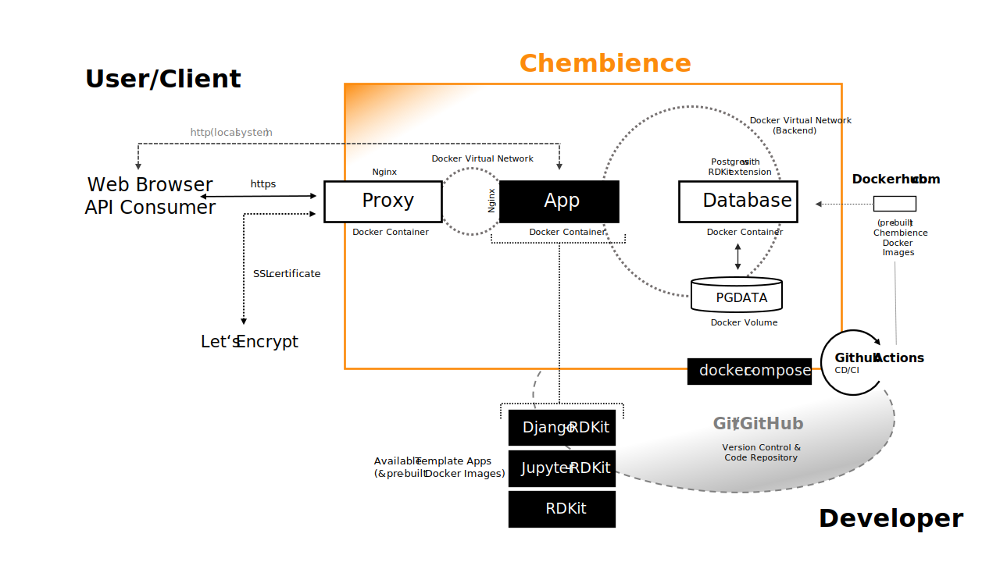

Chembience
==========

.. image:: https://github.com/chembience/chembience/actions/workflows/build_and_publish.yml/badge.svg?tag=v0.4.0
    :target: https://github.com/chembience/chembience/actions

.. image:: https://zenodo.org/badge/124780116.svg
   :target: https://zenodo.org/badge/latestdoi/124780116

.. image:: https://img.shields.io/github/release/chembience/chembience.svg
   :target: https://img.shields.io/github/release/chembience/chembience.svg

.. image:: https://img.shields.io/github/license/chembience/chembience.svg
   :target: https://img.shields.io/github/license/chembience/chembience.svg

Overview
--------

**Chembience** is a `Docker <https://docs.docker.com/>`_-based platform supporting the fast development of
`cheminformatics <https://en.wikipedia.org/wiki/Cheminformatics>`_-centric web applications and microservices.
It creates a clean separation between your scientific web service implementation and any host-specific or
infrastructure-related configuration requirements. The following schema gives an overview.

Chembience allows for the easy installation of pre-configured template application packages in just a few steps.
Each of the Chembience applications is Docker-based and provides access to a readily configured
`Postgres <https://www.postgresql.org/>`_ *Databases* instance running in a separate Docker container
on the same Docker virtual network (*Chembience Backend Network*). For the efficient handling of
chemistry-related data and information, all Chembience applications and the *Database* image have the
`RDKit <http://www.rdkit.org/>`_ toolkit installed, either as Python module or Postgres extension, respectively.
For the connection to the intranet or local network, some of application Docker images provide a
`Nginx <https://www.nginx.com>`_-based web server instance as a component of their Docker images.
For outside-facing traffic to the Internet, a pre-configured *Proxy* module is available which acts as a reverse proxy
including the management of SSL/TLS certificates.

Currently, three Chembience template application packages are available:
(1) *Django-RDKit*, a `Django <https://www.djangoproject.com/>`_ /`Django REST framework <https://www.django-rest-framework.org/>`_-based
application which is specifically suited for starting the development of web-based `Python <https://www.python.org/>`_
REST and microservices, (2) *Jupyter-RDKit*, a `Jupyter <https://www.jupyter.org/>`_-based application which lets you
execute Jupyter notebooks locally at a Web browser, and (3) a basic *RDKit* application, which allows for the execution
of Python scripts including any RDKit functionality.

The creation and deployment of all Chembience-based Docker images and application containers can be orchestrated by the
developer with the help of `docker-compose <https://docs.docker.com/compose/>`_. Any Docker image required for starting
up one of the Chembience applications or components is continuously built and tested with
`Github Actions <https://github.com/chembience/chembience/actions>`_ and made available for Docker pull at
`Chembience Docker hub repository <https://hub.docker.com/u/chembience/>`_). Alternatively,
the Docker images can also be built and extended locally on the user's host machine by using the provided build scripts.

If a Chembience-based application is started, a Docker virtual network (*Chembience Backend Network*) is created on the
Docker host system, as well as the requested Chembience application and components, e.g. the *Database* container,
are brought up together at once. Depending on the current use case, a different set of the available Chembience
container components can be easily configured and put together by adjusting the docker-compose configuration file.

Another Docker container-based component of Chembience is the Chembience *Proxy* module which is based on the
`jwilder/nginx-proxy project <https://github.com/jwilder/nginx-proxy>`_. The *Proxy* acts as a reverse proxy in front of
Chembience *Django-RDKit* application containers and allows for spinning up additional application instance, or
updating and removing existing ones, while avoiding interference with web traffic to other running Chembience-based
services and containers. The *Proxy* works in a way that it automatically discovers any existing or newly starting
application containers inside a secondary Docker virtual network between the application container and
the proxy module. During the start up of the application container, the *Proxy* is capable of detecting the (sub) domain
specification given in the configuration of the application. This makes the application accessible from the
outside of the *Chembience Backend* network under the specified application domain names, the latter either being a
DNS-registered Web domain or any sub domain at localhost in case of a locally running Web application. If configured
accordingly, a SSL/TLS certificate can be automatically registered with `Let's Encrypt <https://letsencrypt.org/>`_

In general, all of the Chembience application packages can be easily altered, cloned, removed, or reconfigured. After
the initialization of the Chembience base system (see `Quick Start: Base Installation`_ below), the file directory of
a Chembience application initially created as a template can be moved, renamed, extended, or copied. This allows for
the creation of multiple, specialized application packages, which then can be handled as software projects of their own.
If additional infrastructure packages are required for a project (e.g. Solr, elasticsearch, or additional Postgres
container instances), they can be easily add as additional components of the docker-compose service configuration.

Current release version of the most important packages are:

* RDKit 2021.09.4
* Python 3.9.5
* Django 4.0 + Django Rest Framework 3.13
* Jupyter 6.4
* Postgres 13
* Nginx 1.19 (Reverse Proxy)

Releases
--------

- 0.4.0 (February 2022), new major release: rework of the project structure, update RDKit to version 2021.09.4, update to Postgres 13 with RDKit 2021.03.4 extension, update to Python 3.9.x/Miniconda3-py39_4.10.3-Linux-x86_64.sh, change build system from CircleCi to GitHub Actions, update to Django 4.0.x/Django Restframework 3.13.x, update to Nginx 1.19, update to Jupyter 6.4.x, update of Docker Images to Debian Bullseye-Slim, smaller Docker images
- 0.3.0 (no public release)
- 0.2.18 (March 2021), update to RDKit 2020.09.3 and Postgres 13 (new dependency to chembience/docker-postgres-rdkit-compile)
- 0.2.17 (June 2020), update Python 3.8 (3.8.3) and RDKit 2020.03.2
- 0.2.16 (April 2020), update to RDKit 2020.03
- 0.2.15 (March 2020), update to Python 3.7.6, RDKit 2019.09.3, Postgres 11.7 and Django 2.2.8/DRF 3.11, Jupyter 6.0.4, Nginx 1.17
- 0.2.14 (October 2019), update to RDKit 2019.09
- 0.2.13 (September 2019), update to RDKit 2019.03.4, Postgres 11.5 and Django 2.2.6
- 0.2.12 (August 2019), update to RDKit 2019.03.3, Postgres 11.4; (Mini)Conda has been updated to version 4.7.10
- 0.2.11 (June 2019), update to RDKit 2019.03.2, Django 2.2, Postgres 11.3; all Docker images are now based on Debian buster
- 0.2.10 (Easter 2019), update to RDKit 2019.03
- 0.2.9 (April 2019), update to Postgres 11.2
- 0.2.8 (March 2019), update to RDKit 2018.09.2 and Postgres 10.7
- 0.2.7 (January 2019), maintenance release
- 0.2.6 (November 2018), update to RDKit 2018.09.1 and Python 3.7
- 0.2.5 (October 2018), update to RDKit 2018.09, project improvements for production settings (easier Nginx proxy config; separation of app services and proxy)
- 0.2.4 (September 2018), SSL certificate registration with `Let's Encrypt <https://letsencrypt.org/>`_, project improvements
- 0.2.3 (August 2018), update to RDKit 2018.03.4, Postgres 10.5, Django 2.1 and Nginx 1.14, further project clean-up
- 0.2.2 (July 2018), CircleCi builds, automated UID and GID configuration, clean up & bug fixes
- 0.2.1 (June 2018), update to RDKit 2018.03.2, switch to Postgres 10.4
- 0.2.0 (May 2018), switch to RDKit 2018.03, addition of Jupyter *App* container, project clean-up
- 0.1.1 (April 2018), minor bug fixes
- 0.1.0 (March 2018), first beta

Requirements
------------

Please have at least `Docker CE 20.10 <https://docs.docker.com/engine/installation/>`_
and `Docker Compose 1.29 <https://docs.docker.com/compose/install/>`_ installed on your system. Chembience might run
with earlier versions of both software packages but this is untested. Additionally a reasonable recent version of git
is required.

Quick Start: Base Installation
------------------------------

Clone the repository::

    git clone https://github.com/chembience/chembience.git chembience

Then, change into the newly created directory ::

    cd chembience/

and run the following command (it is important that you do this from inside the ``chembience`` directory) ::

    ./init all

During the initial setup, the init command is downloading some of the necessary Chembience Docker images to your system
which may take some time.

**Note**: alternatively, you might want to initialize only specific applications or components of Chembience,
respectively. This is done by specifying ``django``, ``jupyter``, ``rdkit``, ``proxy``, or any combinations of those,
instead of ``all`` as initialization target.

After a successful download and run of the initialization, a new directory ``chembient/`` has
been created in your home directory ::

    cd ~/chembient

which has the following structure ::

    chembient/django
             /jupyter
             /rdkit
             /share
             /proxy

The first three directories contain base versions of the *Django-RDKit*, *Jupyter-RDKit*, and the basic *RDKIT*
application, respectively.  Their specific configuration will be discussed in the following sections.
The ``share/`` directory can be used to share resources and python packages among Chembience application instances.
Finally, the ``proxy/`` directory is the home of the Chembience *Proxy* module. Its configuration and usage is also
described in a section below.

The location and name of these base application directories is freely re-configurable, in fact, it isn't even required
to keep them in the ``chembient`` parent directory. Reconfiguration can either be accomplished by setting the variables
``DJANGO_APP_HOME``, ``JUPYTER_APP_HOME``, ``RDKIT_APP_HOME`` or ``CHEMBIENCE_PROXY_HOME`` in file ``settings.env`` at
the root directory of the cloned chembience directory before running the ``init`` script; or later, by setting the
variable ``APP_HOME`` or ``PROXY_HOME`` in file ``app.env`` or ``proxy.env``, respectively, at the corresponding app/proxy
directory before running the ``init`` script there.

Quick Start: *Django-RDKit* App
--------------------------------

After the base installation of Chembience (see previous section `Quick Start: Base Installation`_), go into
directory ::

    cd ~/chembient/django

which has the following layout: ::

    .env
    app.env
    appsite
    build
    django-init
    django-manage-py
    docker-compose.build.yml
    docker-compose.yml
    docker-entrypoint.sh
    Dockerfile
    env-parse
    init
    nginx
    postgres-init.d
    psql
    remove
    requirements.txt
    shell
    up
    uwsgi-log

For this quick start section, only the most important of these files will be discussed. The command ``./up`` will start
up an instance of the  *Django-RDKit* application container and the Postgres *Database* container. The initial
configuration of the containers is provided in the ``.env`` file and orchestrated by the ``docker-compose.yml`` file.

**NOTE**: in its default configuration, the *Django-RDKit* application container connects to port 8000 of the host system.
If this port is already in use, set variable ``APP_CONNECTION_PORT`` in file ``app.env`` and run the local ``init`` script.

If everything went fine, you should now be able to go to ::

    http://localhost:8000      (you should see the welcome page of a bare Django installation)

For the initial setup of Django, still a few steps needs to be done. Since Django runs inside a Docker container, you can
not directly access Django's administration script ``manage.py`` in order to set up things. Instead, you have to use
the ``django-manage-py`` script provided in the current directory which passes any arguments to the ``manage.py`` script
of the Django instance running inside the *Django-RDKit* application container.

To finalize the initial setup of Django in your container instance, run these commands (except for using
``django-manage-py`` instead of ``manage.py`` these are the same steps as for any Django installation including the
set up of Django's admin pages) ::

    ./django-manage-py migrate           (creates the initial Django database tables)
    ./django-manage-py createsuperuser   (will prompt you to create a Django superuser account)
    ./django-manage-py collectstatic     (adds all media (css, js, templates) for the Django admin application; creates a ``static/`` directory in the django directory)

After running these commands you should be able to go to ::

    http://localhost:8000/admin

and login into the Django admin application with the just set up account and password.

** Note**: since Chembience 0.4.0 a shortcut script ``django-init`` is provided which runs the three above commands at
once and creates a superuser with default password ``Django0Django0`` if no superuseruser account has been created
before. ::

    ./django-init   (then go to http://localhost:8000/admin)

From here, you can start the development of your own Django application. The basic Django project installation can
be found in the local ``appsite`` directory. If you already know how to develop apps with Django framework, this should
look familiar to you. If not, go to the `official Django tutorial <https://docs.djangoproject.com/en/4.0/intro/tutorial01/>`_ as a
starting point (you can jump there to section *Creating the Polls app* because anything before this step is already
done, also the database setup sections can be skipped). Because the ``appsite`` directory is bind-mounted by Docker
into the Django-RDKit application container, any changes are immediately active inside the container
and the web service you are developing (if not, touch directory ``appsite``; for some changes in ``appsite/appsite`` and
Django's ``settings.py``, a container restart might be necessary by running ``docker-compose restart``. Check also the
nginx and uwsgi configuration in directory ``~/chembient/django/nginx``).

In order to remove the whole Chembience stack of the *Django-RDKit* application and *Database* container down again, use
the ``remove`` script::

    ./remove  (WARNING: This will remove anything including the content of the database.)

If you just want to shutdown the application without loss of data and for a later restart, use the ``stop`` script::

    ./stop  (later restart with ./up again)

Generally, if you are familiar with ``docker-compose``, all life-circle commands of docker-compose should work as
expected. For changes in the configuration of the *Django-RDKit* application, edit file ``app.env`` accordingly and run
the local ``init`` script::

    ./init      (after editing file 'app.env')

If you need additional python packages not present in the default Chembience *Django-RDKit* application, add them to file
``requirements.txt`` and run::

    ./build

This will build a new local Docker image with the required packages added.

Quick Start: *Jupyter App*
--------------------------

After the initial installation of Chembience (see previous section `Quick Start: Base Installation`_), go into directory ::

    cd ~/chembient/jupyter

which has the following layout: ::

    .env
    app.env
    build
    docker-compose.build.yml
    docker-compose.yml
    docker-entrypoint.sh
    Dockerfile
    env-parse
    init
    jupyter
    jupyter_notebook_config.py
    nginx
    notebooks
    postgres-init.d
    psql
    remove
    requirements.txt
    shell
    stop
    up

For this quick start section, only the most important of these files will be discussed. The command ``./up`` will start
up an instance of the  *Jupyter-RDKit* application container and the Postgres *Database* container. The initial
configuration of the containers is provided in the ``.env`` file and orchestrated by the ``docker-compose.yml`` file.

**NOTE**: in its default configuration, the *Jupyter-RDKit* application container connects to port 8001 of the host system.
If this port is already in use, set variable ``APP_CONNECTION_PORT`` in file ``app.env`` and run the local ``init`` script.

If everything went fine, you should now be able to go to ::

    http://localhost:8001       (you should see the login page of the Jupyter notebook server)

Login to the Jupyter notebook server with the password ``Jupyter0``. If you know Jupyter, everything should look familiar
to you now. If you are new to Jupyter, you can find the `documentation here <http://jupyter-notebook.readthedocs.io/>`_.
Since Jupyter runs inside a Docker container, its ``jupyter`` command is not accessible directly; instead you have to
use the ``jupyter`` script inside the *Juypter-RDKit* application directory which will pass all subcommands into the
running container::

    ./jupyter [subcommands]

If you want to add and run existing Jupyter notebooks to the *Juypter-RDKit* application, you need to place them in
directory::

    ~chembient/jupyter/notebooks

Likewise, if you create new Jupyter notebooks in the *Jupyter-RDKit* application and safe them, you will find them at
this directory.

For connecting to the database, do the following (if you use an unchanged Chembience configuration, use the shown
database connection parameters verbatim, they are not just placeholders):

.. code-block:: python

    import psycopg2
    import pprint

    conn_string = "host='db' dbname='chembience' user='chembience' password='Chembience0'"
    conn = psycopg2.connect(conn_string)
    cursor = conn.cursor()

    # rdkit extension installed?
    cursor.execute("select * from pg_extension")
    extensions = cursor.fetchall()
    pprint.pprint(extensions)

In order to remove the whole Chembience stack of the *Jupyter-RDKit* application and *Database* container down again, use the
``remove`` script::

    ./remove  (**WARNING**: This will remove anything including the content of the database.)

If you just want to shutdown the application without loss of data and for a later restart, use the ``stop`` script::

    ./stop  (later restart with ./up again)

Generally, if you are familiar with ``docker-compose``, all life-circle commands of docker-compose should work as
expected. For changes in the configuration of the *Jupyter-RDKit* application, edit file ``app.env`` accordingly and run
the local ``init`` script::

    ./init      (after editing file 'app.env')

If you need additional python packages not present in the default Chembience *Jupyter-RDKit*, add them to file
``requirements.txt`` and run::

    ./build

This will build a new local Docker image with the required packages added.

Quick Start: RDKit Template App
-------------------------------

After the quick start installation of Chembience (see section `Quick Start: Base Installation`_), go into directory ::

    cd ~/chembient/rdkit

You will see the following layout::

    .env
    app.env
    build
    docker-compose.build.yml
    docker-compose.yml
    docker-entrypoint.sh
    Dockerfile
    env-parse
    init
    postgres-init.d
    psql
    remove
    requirements.txt
    run
    script.py
    shell
    stop
    up

For this quick start section, only the most important of these files will be discussed. The ``./up`` command will start
up the database and the *RDKIT* application executing a regular interactive python shell. For connecting to
the database, do the following (if you use an unchanged Chembience configuration, use the shown database connection
parameters verbatim, they are not just placeholders):

.. code-block:: python

    import psycopg2
    import pprint

    conn_string = "host='db' dbname='chembience' user='chembience' password='Chembience0'"
    conn = psycopg2.connect(conn_string)
    cursor = conn.cursor()

    # rdkit extension installed?
    cursor.execute("select * from pg_extension")
    extensions = cursor.fetchall()
    pprint.pprint(extensions)

If you use the ``./run`` command, it does the same without starting an interactive shell, however, it will pass any
command line arguments to the Python interpreter running in the *RDKit* application container. The Python interpreter
has the current application directory (``~/chembience/rdkit``) available on its PYTHONPATH, i.e. if you add a script
named script.py to the RDKit *App* directory you can run it like this::

    ./run script.py

The same is true for any python module or package put into the ``~/chembience/share`` directory.

For changes in the configuration of the *RDKit* application container, edit file ``app.env`` accordingly and run the
local script ``init``::

    ./init      (after editing file 'app.env')

Quick Start: Proxy
------------------

Beginning with Chembience version 0.2.4, the *Proxy* container is not started as part of the Django anymore. Instead,
it has to be started separately. If Chembience is used in default configuration, go into directory ::

    cd ~/chembient/proxy

and use the ``up-without-letsencrypt`` script there ::

    ./up-without-letsencrypt

This will make the *Proxy* available at ::

    http://localhost        (don't worry, the reverse proxy will report with *503 Service Temporarily Unavailable* there)

The *Proxy* will connect to port 80 and 443 of the host system. If these ports are in use, adjust
variable ``CHEMBIENCE_PROXY_EXTERNAL_PORT`` and ``CHEMBIENCE_PROXY_EXTERNAL_SSL_PORT`` at the file ``proxy.env``
and run the local ``init`` script: ::

    ./init      (after editing file 'proxy.env')

before using ``./up-without-letsencrypt``. If a basic Chembience *Django-RDKit* application instance is running,
it also should be available from the *Proxy* now (if this doesn't work, your local network configuration might not allow
for resolving subdomains) ::

    http://django.localhost

Please note that using the *Proxy* isn't necessary when using Chembience just for development purpose.

Using the Proxy in production setting and with HTTP
----------------------------------------------------

As a prerequisite, your DNS-registered domain (e.g. www.example.com) has to be set up properly with your domain provider.
Unfortunately it is hard to give a general description here.

Bring the proxy up as described in the `Quick Start: Proxy`_ section. The port, the *Proxy* is connecting to, needs to
be set to an outside-accessible port on your public web server/host (usually port 80).

Additionally, before any *Django-RDKit* application is brought up, the variable ``APP_VIRTUAL_HOSTNAME`` in
the ``app.env`` file of the Django application has to be set to the URL-domain, e.g. "www.example.com" (**Note**: don't
forget to run the init script of the Django application if the APP_VIRTUAL_HOSTNAME had to be changed).

Using the Proxy in production setting and with HTTPS
----------------------------------------------------

As a prerequisite, your DNS-registered domain (e.g. www.example.com) has to be set up properly with your domain provider.
Unfortunately it is hard to give a general description here.

For HTTPS access, the *Proxy* container has to be started from ::

    cd ~/chembient/proxy

and the command::

    ./up

The ports the *Proxy* is connecting to need to be set to an outside-accessible port on your public web server/host
(usually port 80 and 443).

Additionally, before any Chembience *Django-RDKit* application is brought up, set both the variable
``APP_VIRTUAL_HOSTNAME`` and ``LETSENCRYPT_HOST`` in the ``app.env`` file of the Django application to your URL-domain,
e.g. "www.example.com" (**Note**: don't forget to run the init script of the Django application if any changes have
been made to the configuration).
Also, specify variable ``LETSENCRYPT_EMAIL`` there. For a test run, keep variable ``LETSENCRYPT_TEST`` to ``true`` and
check with ``docker-compose logs`` in directory ``~/chembient/proxy`` for error messages. For the final registration run
set ``LETSENCRYPT_TEST`` to ``false``. Also consult `this page <https://github.com/JrCs/docker-letsencrypt-nginx-proxy-companion>`_
for further advice (the package described there is used for Chembience SSL support, however, for an initial set-up of
Chembience no further configuration is required)

Bugs, Comments and anything else
--------------------------------

For any bug reports, comments or suggestion please use the tools here at Github or contact me by email.

Markus Sitzmann, 2022-02-22
